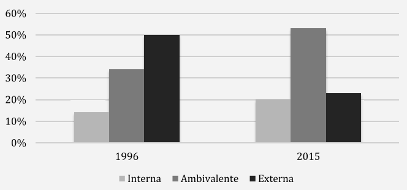

class: inverse, center, middle
```{r setup, include=FALSE}
options(htmltools.dir.version = FALSE)
```
```{r packages-data, include=FALSE}
pacman::p_load(kableExtra,summarytools,plm,lmtest,texreg,ggplot2,GGally,tidyverse,dplyr,haven,gtsummary,nnet,psych, psy, nFactors, sjlabelled, sjmisc, car, corrplot, polycor, GPArotation, nortest, tseries, lavaan, palmerpenguins, tibble,sjPlot, ggpubr,knitr,fastDummies,ordinal,stargazer,MASS,poLCA,memisc) 

load(file = "../Input/Data_proc/2019/proc_cep_2019.RData")
load(file = "../Input/Data_proc/2019/data_naomit2019.RData")
load(file = "../Input/Data_proc/proc_data.RData")
load(file = "../Input/Fondecyt/Data_proc/data.RData")
```
```{r xaringan-themer, include=FALSE, warning=FALSE}
library(xaringanthemer)
style_mono_light(base_color = "#23395b",
  header_font_google = google_font("Merriweather"),
  text_font_google   = google_font("Poppins", "350", "350i"),
  code_font_google   = google_font("Fira Mono")
)
```
```{r include=FALSE}
table_format = if(is_html_output()) {
  "html"
} else if(is_latex_output()) {
  "latex"
}

table_format2 = if(is_html_output()) {
  T
} else if(is_latex_output()) {
  F
}
```
```{css, echo = FALSE}
.regression table {
  font-size: 12px;     
}

.red { color: red; }

.tiny-text {
  font-size: 16px;
}

remark.macros.scale = function (percentage) {
  var url = this;
  return '';
}
```
```{r include=FALSE}
furniture::table1(proc_data,
  "Primera mención Atribuciones de pobreza" = Att_p1, "Segunda mención Atribuciones de pobreza" = Att_p2,bold = TRUE,
  splitby = ~año,
  test = TRUE,
  na.rm = FALSE,
  format_number = TRUE) -> tab_pob

furniture::table1(proc_data,
  "Primera mención Atribuciones de riqueza" = Att_r1, "Segunda mención Atribuciones de riqueza" = Att_r2,bold = TRUE,
  splitby = ~año,
  test = TRUE,
  na.rm = FALSE,
  format_number = TRUE) -> tab_riq

furniture::table1(proc_data,
  "Percepcion de merito esfuerzo" = percep_esfuerzos, "Percepcion de merito inteligencia y capacidades" = percep_inteligencia,"Preferencia meritocracia: responsabilidad" = pref_responsabilidad,"Preferencia meritocracia: educacion" = pref_educacion,"Preferencia meritocracia: trabajo duro" = pref_trabajo,bold = TRUE,
  splitby = ~año,
  test = TRUE,
  na.rm = FALSE,
  format_number = TRUE) -> tab_merit

furniture::table1(proc_data,
  "Clases predichas" = pred_atribuciones,bold = TRUE,
  splitby = ~año,
  test = TRUE,
  na.rm = FALSE,
  format_number = TRUE) -> tab_clases

cap3 <- ""
cap4 <- ""
cap5 <- ""


## Correlacion CEP 2019

data_num2 <- data_naomit2019 %>% dplyr::select(percep_inteligencia,percep_ambicion,percep_esfuerzos,
                                               pred_atribuciones_ord)

data_num2$pred_atribuciones_ord<-as.numeric(data_num2$pred_atribuciones_ord)

cormerit2019=cor(data_num2, use = "complete.obs")
windowsFonts(A = windowsFont("Times New Roman"))
rownames(cormerit2019) <-c(
  "(1) Percepción meritocratica: Inteligencia",
  "(2) Percepción meritocratica: Ambicion",
  "(3) Percepción meritocratica: Esfuerzo",
  "(4) Atribuciones de pobreza y riqueza")
colnames(cormerit2019) <-c("(1)", "(2)","(3)","(4)")

## Modelo de regresion CEP 2019

m1 <- polr(pred_atribuciones_ord ~ percep_inteligencia + percep_esfuerzos + percep_ambicion, data=data_naomit2019)
m2 <- polr(pred_atribuciones_ord ~ percep_inteligencia + percep_esfuerzos + percep_ambicion + pref_responsabilidad + pref_educacion + pref_trabajo, data=data_naomit2019)
m3 <- polr(pred_atribuciones_ord ~ percep_inteligencia + percep_esfuerzos + percep_ambicion + pref_responsabilidad + pref_educacion + pref_trabajo + sexo + ESS + nivel_educ, data=data_naomit2019)

## Correlación Fondecyt 2019

# Asociacion variables
data_cor <- data %>% dplyr::select(merit_perc_effort,merit_perc_talent,merit_pref_effort,merit_pref_talent,
                                              atrib_pob_1,atrib_pob_3,
                                              atrib_riq_1,atrib_riq_3)
cormerit_fondecyt=cor(data_cor, use = "complete.obs")
windowsFonts(A = windowsFont("Times New Roman"))
rownames(cormerit_fondecyt) <-c(
  "(1) Percepción meritocratica basado en esfuerzo",
  "(2) Percepción meritocratica basado en talento",
  "(3) Preferencia meritocratica basado en esfuerzo",
  "(4) Preferencia meritocratica basado en talento",
  "(5) Atribucion pobreza Falta habilidad",
  "(6) Atribucion pobreza Falta esfuerzo",
  "(7) Atribucion riqueza Talento",
  "(8) Atribucion riqueza Trabajo duro")
colnames(cormerit_fondecyt) <-c("(1)", "(2)","(3)","(4)","(5)", "(6)","(7)","(8)")

## Modelo de regresion Fondecyt 2019


## Analisis multivariado 2000, 2009 y 2019


## Modelo multivariado 2000, 2009 y 2019

proc_data$año<-as.factor(proc_data$año)
# Dummy para cada año

proc_data <- dummy_cols(proc_data,select_columns = "año")

model1 <- polr(pred_atribuciones_ord ~ año_2009*(percep_inteligencia+percep_esfuerzos) + año_2019*(percep_inteligencia+percep_esfuerzos) + pref_responsabilidad + pref_educacion + pref_trabajo + sexo + ESS, data=proc_data)

```

# Contenido:


1. Problema de investigación
1. Antecedentes
1. Pregunta, objetivos e hipótesis
1. Datos, variables y métodos
1. Avances de análisis
1. Discusión
1. Bibliografía
---
class: inverse, middle, center

# 1. Problema de investigación
---

###  Problema de investigación

- Cambios estructurales
    + "Cuando hay crecimiento económico, por definición, hay individuos que suben." (Dubet, 2021, pág. 482)

- Cambios en la experiencia, subjetividades y valores (Araujo, 2017; Mac-Clure et al., 2019; Frei et al., 2020; Dubet, 2021).

- Altos niveles de desigualdad socioeconómica en Chile se han mantenido constantes (PNUD, 2017; Rodríguez Weber, 2017).
    + "Cada vez hay más desigualdades, pero parecen ser cada vez más y más individuales y menos colectivas." (Dubet, 2021, pág. 484).
    
#### Problema social: ¿Cómo se sostienen estas desigualdades?

- Algunas creencias de la población tienen como efecto la legitimación de desigualdades (Kluegel y Smith, 1986). En parte, esto resulta de las creencias y actitudes negativas hacia la pobreza (Hoyt et al., 2021)

#### Problema de investigación: ¿Qué influye en que se generen estas creencias "negativas" hacia la pobreza?

- La "ficción meritocrática" afecta en mayor medida a los pobres y termina materializandose en instituciones (Dubet, 2021) o en actitudes (Hoyt et al., 2021)


---
class: middle, center

# ¿De qué manera se relacionan las creencias meritocráticas con las atribuciones de pobreza y riqueza? 
# Y 
#¿Cómo se comporta esta relación en el tiempo?

---


class: inverse, middle, center

# 2. Antecedentes

---

# Variable dependiente: .red[ Atribuciones de pobreza y riqueza]

- El cómo las personas se representan y explican que ciertos grupos sociales sufran carencias o disfruten de grandes ventajas (Kluegel y Smith, 1986).

- **Atribuciones internas**: se responsabiliza al individuo

- **Atribuciones externas**: explicaciones por causas estructurales

- **Atribuciones ambivalentes**: combinación de ambas

---

## Medición: atribuciones de pobreza y riqueza

- Ausencia de escala común

    + Lista de causas de pobreza y riqueza con respuesta liker de acuerdo-desacuerdo.
    
    + Lista de causas de pobreza y riqueza en la que se selecciona una o dos respuestas.

- Ausencia de agenda investigativa clara

- Ambigüedad en algunas categorías

---

##  ¿Por qué estudiar atribuciones de pobreza y riqueza?

Las atribuciones internas se han relacionado con distintas variables, jugando un rol importante en la legitimación de las desigualdades socioeconómicas. Algunas de ellos son: 

- Estigmatización y deshumanización de grupos sociales (Sainz et al., 2019; Sainz et al., 2020)

- Actitudes negativas inter-grupales (Madeira et al., 2019)

- Legitimación de desigualdades socioeconómicas (Stephenson,2000; Lepianka, van Oorschot y Gelissen, 2009)

- Disposición hacia políticas redistributivas (Bullock et al., 2003; Kornbluh et al., 2019; Sainz et al., 2019; Sainz et al., 2020)

---
## Cambios en el tiempo en las atribuciones de pobreza y riqueza en Chile

- Existe poca evidencia sobre cambios en el tiempo en las atribuciones de pobreza y riqueza, tarea que se vuelve aún más compleja debido a la ausencia de una escala común para medir las atribuciones.

- Entre 1996 y 2015 existe un aumento en atribuciones internas y disminución en atribuciones externas, lo cual apunta a la adopción de un ethos más individualista. Sin embargo, el aumento es mucho más sustantivo para las atribuciones ambivalentes, lo que complejiza el análisis (Frei et al., 2020). 

- Antecedentes empíricos y teóricos coinciden en un proceso de *individualización* en la sociedad chilena.


---
class: middle

**Figura 1** 
Porcentaje de tres clases de atribuciones de pobreza y riqueza.

.center[

]

**Fuente**: Extraído de Frei, Castillo y Herrera (2020). *¿Fruto del esfuerzo? Los cambios en las atribuciones sobre pobreza y riqueza en chile entre 1996 y 2015*. 
---

## Antecedentes atribuciones de pobreza y riqueza

### .black[Determinantes objetivos-estructurales]

Sociodemográficas y de estratificación social:

- Variable raza/etnia (Kluegel y Smith, 1981)

- Variable ingreso: distintos resultados. (1) A mayor ingreso, más atribuciones internas. (2) A mayor ingreso, menos atribuciones internas (Frei et al., 2019). 

- Variable edad: a mayor edad, más atribuciones internas (*ibid*).

- Variable educación: más escolarización, más atribuciones internas (*ibid*).

---

### .black[Determinantes subjetivos]

- Valores y experiencia individual. (Lepianka et al., 2009)
      
- Meritocracia:
      
     1. **Lepianka et al. (2009)**: A medida que la gente respalda con más fuerza el principio de mérito como justicia, es más probable que se atribuya la pobreza a la pereza antes que a causas estructurales.

     1. **Madeira et al. (2019)**: Mayores niveles en la meritocracia descriptiva -**percepciones**- está relacionada con actitudes negativas hacia grupos marginalizados, mientras que la meritocracia prescriptiva -**preferencias**- no lo está.
    + Mayores niveles de **preferencia** meritocrática tienen un menor efecto en actitudes negativas hacia grupos muy desfavorables versus grupos medianamente desfavorables, como también que favorecen la aceptación de políticas sociales.
    
     1. Reciente estudio de **Hoyt y colegas (2021)** muestra que a mayor **percepción** meritocrática, más se culpa a los pobres. A su vez, la culpabilización de la pobreza media la relación entre percepciones meritocráticas y actitudes negativas hacia la pobreza. 
      
---

# Variable independiente: .red[Creencias meritocráticas]

M. Young (1962): meritocracia como un orden social que basa la distribución de los recursos a partir del mérito individual. A su vez, el mérito opera a partir de los criterios de **esfuerzo y talento**.

Sen (2000): combinación de esfuerzo y habilidades individuales.

La idea de una sociedad meritocrática se convierte en un proyecto común para la población, independiente de la posición política y del estrato socioeconómico (Cociña 2013a; Araujo, 2017; Dubet, 2021).

---

###Creencias meritocráticas 

Las creencias de las personas acerca de cómo operan los mecanismos meritocráticos en la sociedad.

- **Percepciones meritocráticas**: cómo la gente percibe -lo que son- de meritocracia en la sociedad

- **Preferencias meritocrácticas**: cómo debiesen funcionar los mecanismos meritocráticos en la sociedad

---

## Medición: creencias meritocráticas

- Confusión en la definición conceptual meritocracia

- Confusión en lo que se entiende por creencias meritocráticas

- Uni-multidimensional

- Debido a todo lo anterior, no se identifica una agenda clara

---

## Cambios en el tiempo de las creencias meritocráticas

- Por lo general estudios se enfocan en percepción meritocrática. 

- Existe una tendencia global a aumentar las percepciones meritocráticas de la mano con el aumento de las desigualdades salariales (Mijs, 2019, 2020)

- No existe evidencia empírica cuantitativa para el caso chileno, aunque investigación cualitativa apunta en la misma dirección

---


---
class: middle

.pull-left[]


.pull-right[]
---

## Relevancia del estudio

**.red[Teórica]**

- En el área de las ciencias sociales, surgen estudios bajo la lógica de la justicia de mercado, la cual sostiene que la posición que ocupan los individuos en la jerarquía social es producto de sus esfuerzos y méritos (Lane, 1986). -**they say**-

- Considerando que las creencias meritocráticas no se oponen a la desigualdad, sino más bien a un tipo de discriminación (Mijs y Savage, 2020), la presente investigación sostiene que las creencias meritocráticas operan como un mecanismo legitimador de las desigualdades  socioeconómicas, por un lado, al culpabilizar a los pobres, y por otro, al atribuir explicaciones individuales sobre la riqueza -**I say**- 

**.red[Académica]**

- Ayuda a distinguir entre ambos conceptos y a analizar su relación de manera empírica. En ocasiones, se utilizan ambos conceptos de manera indiscriminada sin fundamento empírico -como es el caso de la investigación de **Bucca (2016)**-. 

- Estudio reciente (Hoyt et al., 2021) relaciona percepciones meritocráticas con culpabilización de la pobreza. El presente estudio complementa con otras dimensiones de las creencias meritocráticas y de las atribuciones.

- Se busca ahondar de manera empírica en los cambios socioculturales que se han ido generando en la sociedad chilena en dirección de un ethos individualista 

---
class: inverse, middle, center

# 3. Preguntas, objetivos e hipótesis

---

### Pregunta de investigación:

¿Cómo se relacionan las percepciones y las preferencias meritocráticas con las atribuciones de pobreza y riqueza? 

### Objetivos:

1.	Analizar la relación entre atribuciones de pobreza y riqueza con las creencias meritocráticas.

1.	Analizar los cambios en el tiempo en la relación entre atribuciones de pobreza y riqueza con las creencias meritocráticas para los años 2000, 2009 y 2019.

### Hipótesis:

**H1**: A mayor percepción de meritocracia, mayores serán las atribuciones internas hacia la pobreza y la riqueza.

**H2**: Conforme avancen los años, se fortalece la relación de que a mayor percepción meritocrática, mayores las atribuciones internas hacia la pobreza y la riqueza.

---
class: inverse, middle, center

# 4. Datos, variables y método

---

## Datos

- Se utilizan los datos correspondientes a la Encuesta Nacional de Opinión Pública Nº 39 (Marzo-Abril 2000), N° 59 (Mayo-Junio 2009) y N° 83 (Mayo 2019) llevada a cabo por el Centro de Estudios Públicos (CEP). 

- La base de datos del 2000 tiene una muestra compuesta por 1380 encuestados. Para el 2009, la muestra 1505 casos. Por último, para el 2019 la muestra cuenta con 1380 casos. 

- Los procesos de selección de las muestras son probabilísticos, por conglomerados y de multietapas.

#### Pros 

- Combina variables CEP y del ISSP.

- Única opción para analizar las dos variables en el tiempo

#### Contras

- Muestras distintas para cada año

- Medición de atribuciones

- Variables de percepciones meritocráticas varían entre años


---

## Variables dependientes

.pull-left[| Atribuciones de pobreza                                     | Categorización |
|------------------------------------------------------------------------------------------------------------------------------------|
|La mala suerte            | Externa | 
|La flojera y falta de iniciativa                  | **Interna** |
| La falta de educación       | **Interna** |
| La falta de ayuda econ. del gobierno       | Externa |
| Los vicios y el alcoholismo           | **Interna** | 
| Las malas pp. econ. del gobierno | Externa |
| Falta de generosidad de los que tienen más   | Externa |
| Las pocas oportunidades de empleo    | Externa |
| Porque los padres también eran pobres  | Externa |
| Abusos/injusticias del sistema econ. | Externa | 
]


.pull-right[| Atribuciones de riqueza                                     | Categorización |
|------------------------------------------------------------------------------------------------------------------------------------|
|Iniciativa Personal | **Interna** | 
|La suerte           | Externa |
| La Fe en Dios       | Externa |
| Trabajo responsable   | **Interna** |
| Contactos o pitutos       | Externa |
|Nivel educacional alcanzado | **Interna** |
| La situación económica de los padres          | Externa |
| La ayuda económica del Estado  | Externa |
| Las políticas económicas del gobierno | Externa |
| Tener una familia unida que apoya | Externa |
| Haciendo dinero a la mala, con manejos deshonestos o incorrectos | Externa |
]


---

class: title title-8

## Variables independientes

.very-tiny[
| Variable    | Descripción|       Respuesta/valores|
|------------|:-----------:|------------|
| |       **A. Percepciones meritocrática**   |              |
| Tener un buen nivel de educación |   Actualmente en Chile, ¿cuán importante es para surgir en la vida tener un buen nivel de educación? |Likert 1/5: No es importante / Esencial  |
| El trabajo duro | Actualmente en Chile, ¿cuán importante es para surgir en la vida el trabajo duro? | Likert 1/5: No es importante / Esencial |
|  |    **B. Preferencias meritocráticas**     |       |
|El nivel de responsabilidad que tiene su trabajo |  Al decidir cuánto debería ganar la gente, ¿cuán importante debería ser, a su juicio, el nivel de responsabilidad que tiene su trabajo? |Likert 1/5: No es importante / Esencial   |
| El número de años dedicados a educación y capacitación| Al decidir cuánto debería ganar la gente, ¿cuán importante debería ser, a su juicio, el número de años dedicados a educación y capacitación?  | Likert 1/5: No es importante / Esencial  |
| Lo bien que él o ella realiza su trabajo | Al decidir cuánto debería ganar la gente, ¿cuán importante debería ser, a su juicio, lo bien que él o ella realiza su trabajo?  |Likert 1/5: No es importante / Esencial  |
]

---

## Variables de control

.very-tiny[
| Variable    | Descripción|       Respuesta/valores|
|------------|:-----------:|------------|
| Sexo | Sexo del encuestado/a | Hombre (0) / Mujer (1) |
| Edad | Edad del encuestado/a | Escala continua |
| Escolarización | Nivel educacional alcanzado por el/la encuestado/a | "Primaria incompleta menos" = 1, "Primaria y secundaria baja" = 2, "Secundaria alta" = 3, "Terciaria ciclo corto" = 4, "Terciaria y Postgrado" = 5 |
| Estatus social subjetivo | En nuestra sociedad, hay grupos que tienden a ubicarse en los niveles más altos y grupos que tienden a ubicarse en los niveles más bajos. ¿Dónde se ubicaría usted? | Escala de 1 a 10 |
| *Ingresos familiares* | *Tramos de ingresos en los cuales el/la encuestado/a ubica a su hogar* | *Escala de 1 a 10* |
]

---

# Método

- En un primer momento se realiza un análisis de clases latentes (LCA) para identificar y agrupar las variables dependientes según patrones. Para ello, se utilizó la librería “poLCA” de R, versión 1.4.1.

- Luego, se revisarán los descriptivos de las variables independientes en los años 2000, 2009 y 2019, con el objetivo de caracterizar el cambio en las percepciones y preferencias meritocráticas en el tiempo a partir de medidas de tendencia central, de dispersión y proporciones.

- Finalmente se realizará un modelo de regresión ordinal utilizando como variable dependiente las clases obtenidas a partir del LCA. El optar por una regresión ordinal entrega ventajas de parsimonia a la hora de analizar e interpretar el modelo, como también failidades en la comparación de estudios.

---

class: inverse, middle, center

# 5. Avances

---
class: middle, center


# 2019

---

#### Descriptivos CEP 2019

```{r tab-desc1, echo=FALSE}

print(dfSummary(data_naomit2019, 
                varnumbers   = FALSE,
                headings=FALSE, valid.col = FALSE, na.col = FALSE,
                graph.magnif = 0.76), 
      max.tbl.height = 600,
      method = "render")

```

---

#### Composición clases latentes para el 2019 <sup>2</sup>
.pull.center[
```{r echo=FALSE,results='asis',warning=FALSE, message=FALSE}
g1 <- ggplot(data_naomit2019, aes(pred_atribuciones_ord)) + geom_bar(fill="#9999CC", colour="black",aes(y = (..count..)/sum(..count..))) + scale_y_continuous(labels=scales::percent) +
  ylab("Frecuencia relativa") + theme_pubclean() + geom_text(aes(y = (..count..)/sum(..count..),label = ifelse((..count..)==0,"", scales::percent((..count..)/sum(..count..)))), stat="count", vjust=-0.25, size=4) + scale_x_discrete(labels=c("Externa","Ambivalente", "Interna")) + labs(x = "")

g1
```
]

.footnote[
[2] Modelo LCA a partir base CEP 2019
]
---

class: center

### Correlación percepción meritocrática y clases de atribuciones para el 2019

```{r echo=FALSE, results='asis'}
corrplot(cormerit2019,
         method = "color",
         type = "upper",
         tl.col = "black",
         addCoef.col = "black",
         diag = TRUE,
         family = "A",
         number.font = 6,
         tl.cex =0.75,
         number.cex = 1)
```

---
class: regression

## Modelo de regresión ordinal 2019

```{r tab-reg1,echo=FALSE, results='asis',warning=FALSE, message=FALSE}
stargazer::stargazer(list(m1,m2,m3),single.row = T, type = "html")
#pander(mtable123)
```

---

## Modelos con datos de la ola 2 del Fondecyt 
###"ECONOMÍA MORAL DE LA MERITOCRACIA Y PREFERENCIAS REDISTRIBUTIVAS" 2019.

- #### Datos: 1400 datos válidos. Encuesta telefónica.

- #### Medición variables independientes y dependientes: escalas likert

---

### Descriptivos

```{r tab-desc2, echo=FALSE}

print(dfSummary(data, 
                varnumbers   = FALSE,
                headings=FALSE, valid.col = FALSE, na.col = FALSE,
                graph.magnif = 0.76), 
      max.tbl.height = 600,
      method = "render")

```

---
class: center


### Correlación variables independientes y dependientes

```{r echo=FALSE, results='asis'}

corrplot(cormerit_fondecyt,
         method = "color",
         type = "upper",
         tl.col = "black",
         addCoef.col = "black",
         diag = TRUE,
         family = "A",
         number.font = 6,
         tl.cex =0.75,
         number.cex = 1)

```

---
class: middle

### Modelos de regresión 


.pull-left[ **Atribuciones pobreza: falta habilidad**

]

.pull-right[ **Atribuciones pobreza: falta de esfuerzo**

]

---
class: middle

### Modelos de regresión 


.pull-left[ **Atribuciones riqueza: Talento**

]

.pull-right[ **Atribuciones riqueza: Trabajo duro**

]

---

class: inverse, middle, center

## Análisis con cambios en el tiempo 
###(CEP 2000, 2009 y 2019)

---
#### Descriptivos variables con datos de los tres periodos
```{r tab-desc0, echo=FALSE}

print(dfSummary(proc_data, 
                varnumbers   = FALSE,
                headings=FALSE, valid.col = FALSE, na.col = FALSE,
                graph.magnif = 0.76), 
      max.tbl.height = 600,
      method = "render")

```

---

### Variables dependientes

.center[**Atribuciones de pobreza**
```{r tab-descpob, echo=FALSE}
kbl(tab_pob,table_format, caption = cap3, "html", booktabs = T) %>%
kable_styling(
    full_width = T,
    latex_options = c("hold_position"),
    position = "center",
    font_size = 16,
    bootstrap_options=c("striped", "bordered")) %>%
  add_header_above(c("Respuestas"=1, "Descrpitivos" = 3),bold = T)  %>%
  column_spec(column = 1, width = "4 cm", ) %>%
  column_spec(column = 2,width = "2 cm") %>%
  column_spec(column = 3,width = "2 cm") %>%
  column_spec(column = 4,width = "2 cm") #%>%
#  save_kable("Output/Tablas/atribuciones_pobreza_interna_externa.html")
```
]

---

### Variables dependientes

.center[**Atribuciones de riqueza**

```{r tab-descriq, echo=FALSE}
kbl(tab_riq,table_format, caption = cap4, "html", booktabs = T) %>%
kable_styling(latex_options = c("striped", "HOLD_position"),font_size = 16,
    bootstrap_options=c("striped", "bordered")) %>%
  add_header_above(c("Respuestas"=1, "Descrpitivos" = 3),bold = T)  %>%
  column_spec(column = 1, width = "4 cm", ) %>%
  column_spec(column = 2,width = "2 cm") %>%
  column_spec(column = 3,width = "2 cm") %>%
  column_spec(column = 4,width = "2 cm") #%>%
#  save_kable("Output/Tablas/atribuciones_riqueza_interna_externa.html")
```
]

---

### Variables independientes

**Percepciones y preferencias meritocraticas en el tiempo**

```{r tab-descmerit2, echo=FALSE}


kbl(tab_merit,table_format, caption = cap5, "html", booktabs = T) %>%
kable_styling(latex_options = c("striped", "HOLD_position"),font_size = 16,
    bootstrap_options=c("striped", "bordered")) %>%
  add_header_above(c("Respuestas"=1, "Descrpitivos" = 3),bold = T)  %>%
  column_spec(column = 1, width = "4 cm", ) %>%
  column_spec(column = 2,width = "2 cm") %>%
  column_spec(column = 3,width = "2 cm") %>%
  column_spec(column = 4,width = "2 cm") #%>%
#  save_kable("../Output/Tablas/meritocracia_en_tres_años.html")
```

---

### Clases latentes <sup>1</sup>

**Modelo de tres clases para el 2000, 2009 y 2019** 

```{r tab-clases, echo=FALSE}


kbl(tab_clases,table_format, caption = cap5, "html", booktabs = T) %>%
kable_styling(latex_options = c("striped", "HOLD_position"),font_size = 16,
    bootstrap_options=c("striped", "bordered")) %>%
  add_header_above(c("Respuestas"=1, "Descrpitivos" = 3),bold = T)  %>%
  column_spec(column = 1, width = "4 cm", ) %>%
  column_spec(column = 2,width = "2 cm") %>%
  column_spec(column = 3,width = "2 cm") %>%
  column_spec(column = 4,width = "2 cm")
```

.footnote[
[1] Modelo LCA a partir de las bases CEP 2000, 2009 y 2019
]

---

class: regression

### Modelo de regresión con tiempo

```{r tab-reg2, echo=FALSE, results='asis',warning=FALSE}
stargazer::stargazer(model1,single.row = T, type = "html")
```

---

## Discusión:
1. Recomendaciones en operacionalización de variable dependiente -semi abierta-

1. Análisis para cambios en el tiempo


---

## 6.- Bibliografía

- Araujo, K. (2017). Sujeto y neoliberalismo en Chile: rechazos y apegos. Nuevo Mundo Mundos Nuevos, February. https://doi.org/10.4000/nuevomundo.70649

- Barozet, E. (2017). Serie sobre la clase media chilena (2): Ese gran miedo a resbalar. Publicado: 13.04.2017. https://www.ciperchile.cl/2017/04/13/66957/

- Bucca, Mauricio. 2016. “Merit and Blame in Unequal Societies: Explaining Latin Americans’ Beliefs about Wealth and Poverty”. Research in Social Stratification and Mobility 44: 98–112. DOI: https://doi.org/ 10.1016/j.rssm.2016.02.005

- Castillo, J. C., Torres, A., Atria, J., y Maldonado, L. (2019). Meritocracy and economic inequality: Perceptions, preferences and implications. Revista Internacional de Sociologia, 77(1), 1–15. https://doi.org/10.3989/ris.2019.77.1.17.114

- Cociña, M. (2013a). ¿Cree usted que la meritocracia es buena? Publicado el  05.06.2013. https://www.ciperchile.cl/2013/06/05/%C2%BFcree-usted-que-la-meritocracia-es-buena/

- Frei, R., Castillo, J. C., Herrera, R., y Suárez, J. I. (2020). ¿Fruto del esfuerzo? Los cambios en las atribuciones sobre pobreza y riqueza en chile entre 1996 y 2015. Latin American Research Review, 55(3), 477–495. https://doi.org/10.25222/larr.464

- Hoyt, C. L., Burnette, J. L., Forsyth, R. B., Parry, M., & DeShields, B. H. (2021). Believing in the American Dream Sustains Negative Attitudes toward Those in Poverty. Social Psychology Quarterly. https://doi.org/10.1177/01902725211022319

---
- Kluegel, J. R., Smith, E. R. (1986). Social Institutions and Social Change. Beliefs About Inequality: Americans’ Views ofWhat Is and What Ought to be. Hawthorne, NY: Aldine de Gruyter.

- Lepianka, D., van Oorschot, W. y Gelissen, J. (2009). Popular explanations of poverty: A critical discussion of empirical research. Journal of Social Policy, 38, 421-438. https://doi.org/10.1017/S0047279409003092

- Mijs, J. J. B., & Savage, M. (2020). Meritocracy, Elitism and Inequality. Political Quarterly, 91(2), 397–404. https://doi.org/10.1111/1467-923X.12828

- PNUD (2017). Desiguales. Orígenes, cambios y desafíos de la brecha social en Chile. Santiago de Chile, Programa de las Naciones Unidas para el Desarrollo.

- Sainz, M., Martínez, R., Sutton, R. M., Rodríguez-Bailón, R., y Moya, M. (2020). Less human, more to blame: Animalizing poor people increases blame and decreases support for wealth redistribution. Group Processes and Intergroup Relations, 23(4), 546–559. https://doi.org/10.1177/1368430219841135

- Stephenson, S. (2000). Public beliefs in the causes of wealth and poverty and legitimization of inequalities in Russia and Estonia. Social Justice Research, (2), 83–100.

- Young, M. (1962). The Rise of the Meritocracy. Baltimore: Penguin Books.